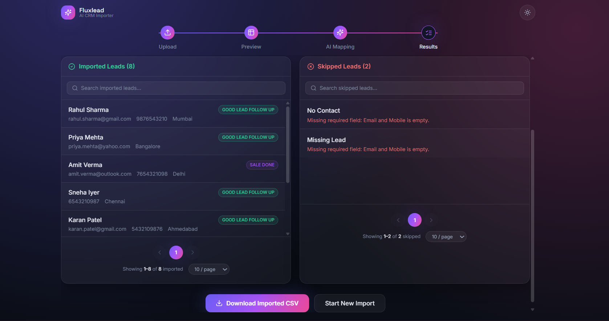

<div align="center">


# ✨ Fluxlead

### AI-Powered CSV → CRM Lead Importer

**Any CSV. Any layout. One clean import — powered by AI.**

<br />

[](https://fluxlead-aicrm.netlify.app)


</div>

<br />

## The problem

Every lead source names its columns differently — `Full name` vs `Customer Name` vs
`Lead`, `Phone Number` vs `Mobile` vs `Contact`. Hardcoded importers break the moment a
new source shows up. **Fluxlead reads the data the way a human would** and maps it into
a fixed CRM schema — no manual column-matching, no dropdowns, just upload and confirm.

**Where this pattern matters:** CRM lead imports, recruiting platforms merging candidate
data, e-commerce catalogs from different suppliers, HR systems migrating records, fintech
reconciling statements from different banks — anywhere "upload your data, we'll handle
the rest" needs to actually work.

<br />

## Preview

<table>
<tr>
<td width="33%"><p align="center"><sub><b>Upload</b> — drag & drop</sub></p></td>
<td width="33%"><p align="center"><sub><b>Preview</b> — before any AI runs</sub></p></td>
<td width="33%"><p align="center"><sub><b>AI mapping</b> — batched, retried</sub></p></td>
</tr>
<tr>
<td width="33%"><p align="center"><sub><b>Results</b> — imported vs skipped</sub></p></td>
<td width="33%"><p align="center"><sub><b>Imported Data</b> — formatted and validated</sub></p></td>
<td width="33%"><p align="center"><sub><b>Analytics</b> — insights and reporting</sub></p></td>
</tr>
</table>

<sub>Screenshots live in <a href="docs/screenshots"><code>docs/screenshots/</code></a> — drop your own captures in with these filenames.</sub>

<br />

## Why it's production-grade, not a demo

- **Fault isolation** — one bad batch of 20 rows never fails the other 480
- **Fail-fast on systemic errors** — a dead API key stops after batch 1, not batch 25
- **AI is validated, never trusted blindly** — every field re-checked against the schema in code
- **Cost-aware** — AI only runs after explicit confirm, never during preview
- **Stateless-by-default** — works with zero database, upgrades automatically if one's connected

<br />

## Stack

| | |
|---|---|
| **Frontend** | Next.js 14 · TypeScript · Tailwind · Framer Motion |
| **Backend** | Node.js · Express · TypeScript |
| **AI** | OpenAI / Gemini / Claude / Groq — swap with one env var |
| **Database** | PostgreSQL (Prisma + Neon) — optional |
| **Hosting** | Render (API) · Netlify (web) · Neon (DB) |

<br />

## How it works

```
Upload → Preview (no AI yet) → Confirm → AI extraction in batches → Imported / Skipped results
```

Rows are batched (default 20/call), sent to the LLM with a strict schema-mapping prompt,
retried on failure with exponential backoff, and every response is validated in code
before it's accepted — enums, dates, and formatting rules included.

<br />

## Run it locally

```bash
# Backend
cd backend && cp .env.example .env && npm install && npm run dev   # :4000

# Frontend
cd frontend && cp .env.example .env.local && npm install && npm run dev   # :3000
```

Or full stack with Docker: `docker compose up --build`

<br />

## API

| Method | Path | Description |
|---|---|---|
| `POST` | `/api/csv/preview` | Parse CSV, no AI |
| `POST` | `/api/csv/import` | Batch AI extraction → structured CRM records |
| `GET` | `/health` | Liveness check |

<br />

---

## 👨‍💻 Author

Developed with ❤️ by **Dinesh Kushwaha**

[](https://www.linkedin.com/in/mrdinesh-kushwaha/)

---
<div align="center">

[](https://fluxlead-aicrm.netlify.app)

</div>
