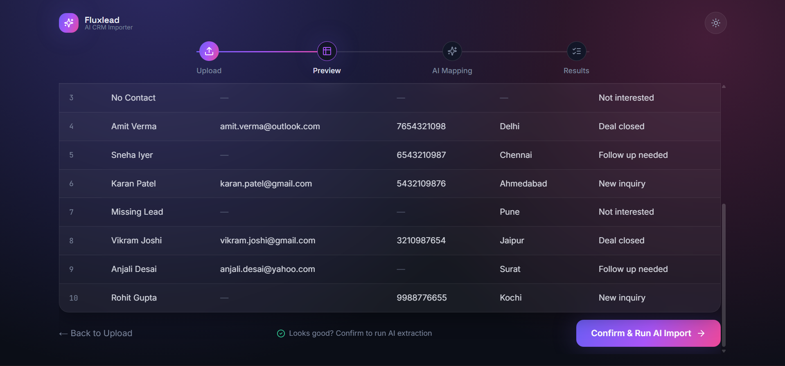
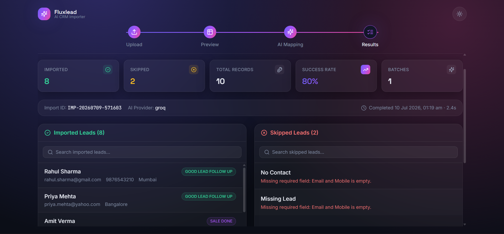
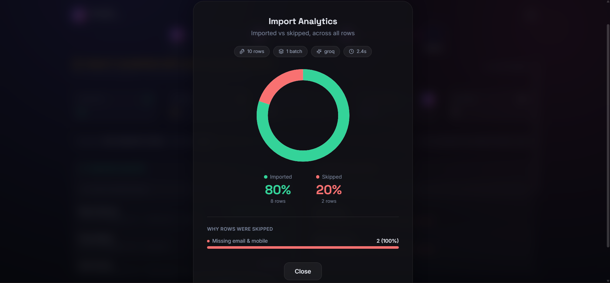

<div align="center">

# ✨ Fluxlead

### AI-Powered CSV → CRM Lead Importer

**Any CSV. Any layout. One clean import — powered by AI.**

<br />

[](https://fluxlead-aicrm.netlify.app)


</div>

<br />

## 🚀 Why this project created

Every lead source names its columns differently — `Full name` vs `Customer Name` vs
`Lead`, `Phone Number` vs `Mobile` vs `Contact`. Hardcoded importers break the moment a
new source shows up. **Fluxlead reads the data the way a human would** and maps it into
a fixed CRM schema — no manual column-matching, no dropdowns, just upload and confirm.

**Where this pattern matters:** CRM lead imports, recruiting platforms merging candidate
data, e-commerce catalogs from different suppliers, HR systems migrating records, fintech
reconciling statements from different banks — anywhere "upload your data, we'll handle
the rest" needs to actually work.

<br />

## 📱 Preview 

<table>
<tr>
<td width="33%"><p align="center"><sub><b>Upload</b> — drag & drop</sub></p></td>
<td width="33%"><p align="center"><sub><b>Preview</b> — before any AI runs</sub></p></td>
<td width="33%"><p align="center"><sub><b>AI mapping</b> — batched, retried</sub></p></td>
</tr>
<tr>
<td width="33%"><p align="center"><sub><b>Results</b> — imported vs skipped</sub></p></td>
<td width="33%"><p align="center"><sub><b>Imported and skippedData</b> — formatted and validated</sub></p></td>
<td width="33%"><p align="center"><sub><b>Analytics</b> — insights and reporting</sub></p></td>
</tr>
</table>

<sub>Screenshots live in <a href="docs/screenshots"><code>docs/screenshots/</code></a> — drop your own captures in with these filenames.</sub>

<br />

## ✅ Why it's production-grade, not a demo 

- **Fault isolation** — one bad batch of 20 rows never fails the other 480
- **Fail-fast on systemic errors** — a dead API key stops after batch 1, not batch 25
- **AI is validated, never trusted blindly** — every field re-checked against the schema in code
- **Cost-aware** — AI only runs after explicit confirm, never during preview
- **Stateless-by-default** — works with zero database, upgrades automatically if one's connected

<br />

## 🧑‍💻 Tech Stack Used 
 
| | |
|---|---|
| **Frontend** | Next.js 14 · TypeScript · Tailwind · Framer Motion |
| **Backend** | Node.js · Express · TypeScript |
| **AI** | OpenAI / Gemini / Claude / Groq — swap with one env var |
| **Database** | PostgreSQL (Prisma + Neon) — optional |
| **Hosting** | Render (API) · Netlify (web) · Neon (DB) |
 
<br />

## 🌐 How it works — 4 steps 
 
```
┌─────────────┐     ┌─────────────┐     ┌─────────────┐     ┌─────────────┐
│   UPLOAD    │ ──▶ │   PREVIEW   │ ──▶ │  AI EXTRACT │ ──▶ │   RESULTS   │
│             │     │             │     │             │     │             │
│ Drag & drop │     │ Parse & show│     │ Batched AI  │     │ Imported /  │
│ or browse   │     │ table — NO  │     │ mapping +   │     │ Skipped +   │
│ a .csv file │     │ AI call yet │     │ retry logic │     │ reasons     │
└─────────────┘     └─────────────┘     └─────────────┘     └─────────────┘
      │                    │                    │                   │
      ▼                    ▼                    ▼                   ▼
  Client-side         GET headers +        POST /api/csv/     Structured JSON:
  file validation     rows returned,       import — only      success[], skipped[],
  (.csv, ≤5MB)         zero AI cost         fires after         totals, reasons
                                             user clicks
                                             "Confirm"
```
 
**Route → step mapping** (each step is a real URL, not a hidden state):
 
| Route | Step | What happens |
|---|---|---|
| `/` | Upload | Client validates file type & size before sending |
| `/preview` | Preview | `POST /api/csv/preview` — CSV parsed, **no AI called** |
| `/processing` | AI Extraction | `POST /api/csv/import` — batched, retried, validated |
| `/results` | Results | Imported / skipped panels, searchable & paginated |
 
<br />

## 🔗 Project structure 
 
```
growease-csv-importer/
│
├── backend/                          Express API
│   ├── src/
│   │   ├── routes/
│   │   │   ├── upload.route.ts        POST /api/csv/preview   (parse only, no AI)
│   │   │   ├── import.route.ts        POST /api/csv/import    (batch AI + validation)
│   │   │   └── history.route.ts       GET  /api/history
│   │   ├── services/
│   │   │   ├── csv.service.ts         Raw CSV → row objects
│   │   │   ├── ai.service.ts          Provider-agnostic AI calls, batching, retries
│   │   │   └── crm.service.ts         Validates AI output into the CRM schema
│   │   ├── middleware/                 Upload limits, centralized error handling
│   │   ├── db/prisma.ts                Optional — only initializes if DB is configured
│   │   └── types/                      Shared TypeScript types & CRM enums
│   ├── prisma/schema.prisma
│   ├── tests/
│   ├── Dockerfile
│   └── render.yaml
│
├── frontend/                          Next.js — one real route per step
│   └── app/
│       ├── page.tsx                    "/"            Upload
│       ├── preview/page.tsx            "/preview"     Preview + Confirm
│       ├── processing/page.tsx         "/processing"  Triggers the AI call
│       ├── results/page.tsx            "/results"     Imported / skipped panels
│       ├── components/                 UploadZone, PreviewTable, ImportedPanel, …
│       └── lib/                        api.ts · storage.ts · usePagination.ts
│
├── docs/screenshots/                  Product tour images
├── samples/                           Example CSVs for testing
├── docker-compose.yml
└── README.md
```
 
**Why this structure:** routes only handle HTTP (parse request → call service → respond).
All business logic — CSV parsing, AI calls, validation — lives in `services/`, with zero
knowledge of Express. That's what makes the extraction logic unit-testable in isolation,
and swapping the AI provider or database never touches a route file.
 
<br />

## 📱 Run it locally
 
```bash
# Backend
cd backend && cp .env.example .env && npm install && npm run dev   # :4000
 
# Frontend
cd frontend && cp .env.example .env.local && npm install && npm run dev   # :3000
```
 
Or full stack with Docker: `docker compose up --build`
 
<br />

---

## 👨‍💻 Author

Developed with ❤️ by **Dinesh Kushwaha**

[](https://www.linkedin.com/in/mrdinesh-kushwaha/)

---
<div align="center">

[](https://fluxlead-aicrm.netlify.app)

</div>
